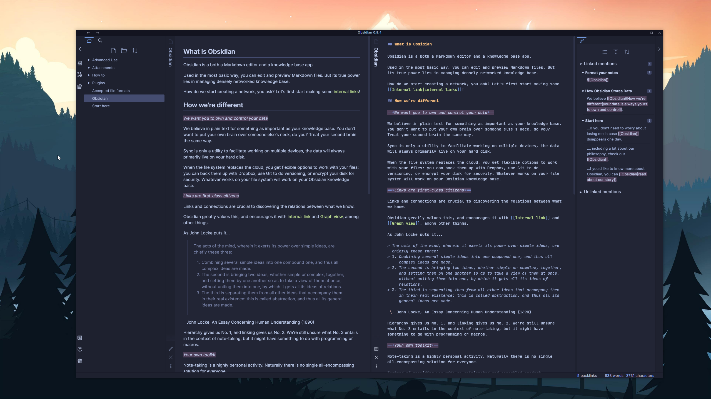

# Moonlight Obsidian Theme

A dark theme for [Obsidian](https://obsidian.md/) inspired by the [Moonlight](https://github.com/atomiks/moonlight-vscode-theme) family of themes.

Comes with built-in support for:

- [Andy Mode](https://forum.obsidian.md/t/andy-matuschak-mode/70)
- [Todoist plugin](https://forum.obsidian.md/t/todoist-sync-plugin-v1-3-1/5849/1)

## Usage

**Important:** This theme uses the [Inter](https://rsms.me/inter/) and [JetBrains Mono](https://jetbrains.com/mono) fonts. For the best experience, I recommend installing these fonts onto your local machine.

1. Open Obsidian and go to the 'Appearance' tab. Ensure that the 'Base mode' setting is set to `Dark mode` and that 'Custom CSS' is turned on.
2. Download either `obsidian.css` or `obsidian-andy.css` from the [latest release](https://github.com/jamiebrynes7/moonlight-obsidian-theme/releases).
   - If you downloaded `obsidian-andy.css`, rename it to `obsidian.css`.
3. Place this in the root of your Obsidian notes directory.
4. Enjoy!
